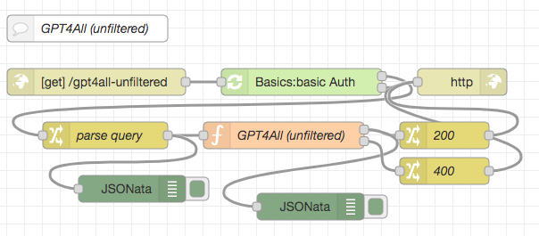
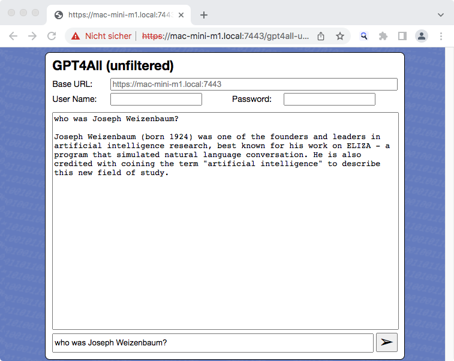

# node-red-flow-gpt4all-unfiltered #

Node-RED Flow (and web page example) for the unfiltered GPT4All AI model

This repository contains a function node for [Node-RED](https://nodered.org/) which can be used to run the [GPT4All model](https://github.com/nomic-ai/gpt4all) in its "unfiltered" form using the [official Typescript binding](https://github.com/nomic-ai/gpt4all-ts) within a Node-RED flow. **Inference is done on the CPU** (without requiring any special hardware) and still completes within a few seconds on a reasonably powerful computer.



Having the actual inference as a self-contained function node gives you the possibility to create your own user interface or even use it as part of an autonomous agent.

> Nota bene: these flows do not contain the actual model. You will have to [download your own copy](https://the-eye.eu/public/AI/models/nomic-ai/gpt4all/gpt4all-lora-unfiltered-quantized.bin).

If you like, you may also check out similar nodes and flows for other AI models as there are

* [Meta AI LLaMA](https://github.com/rozek/node-red-flow-llama)
* [Stanford Alpaca, trained with GPT-3](https://github.com/rozek/node-red-flow-alpaca)
* [Stanford Alpaca, trained with GPT-4](https://github.com/rozek/node-red-flow-gpt4-x-alpaca)
* [Nomic AI GPT4All (filtered version)](https://github.com/rozek/node-red-flow-gpt4all-filtered)
* [Nomic AI GPT4All-J](https://github.com/rozek/node-red-flow-gpt4all-j)
* [Vicuna](https://github.com/rozek/node-red-flow-vicuna)
* [OpenLLaMA](https://github.com/rozek/node-red-flow-openllama)

> Just a small note: if you like this work and plan to use it, consider "starring" this repository (you will find the "Star" button on the top right of this page), so that I know which of my repositories to take most care of.

## Installation ##

Start by creating a subfolder called `.nomic` (mind the leading dot!) within your home directory (on UNIX-like platforms, this folder is accessed using `~/.nomic`). This subfolder will later store the actual model.

### Installing the Typescript binding ###

The actual "heavy lifting" is done by GPT4All's [Typescript binding](https://github.com/nomic-ai/gpt4all-ts).

To install it, simply navigate to the installation folder of your Node-RED server and type

```
npm install gpt4all
```

### Preparing the Model ###

Download the model from the [location given in the docs](https://the-eye.eu/public/AI/models/nomic-ai/gpt4all/gpt4all-lora-unfiltered-quantized.bin) for GPT4All and move it into the folder `.nomic` you created before.

### Importing the Function Node ###

Finally, open the Flow Editor of your Node-RED server and import the contents of [GPT4All-unfiltered-Function.json](./GPT4All-unfiltered-Function.json). After deploying your changes, you are ready to run GPT4All inferences directly from within Node-RED.

## Usage ##

The prompt has to be passed as properties of the msg object, other parameters are not required. The prompt is expected in `msg.payload` and will later be replaced by the result of the inference.

## Example ##

The file [GPT4All-unfiltered-HTTP-Endpoint.json](./GPT4All-unfiltered-HTTP-Endpoint.json) contains an example which uses the GPT4All function node to answer HTTP requests. The prompt has to be passed as a query parameter, the result of the inference will then be returned in the body of the HTTP response.

> Nota bene: the screenshot from above shows a modified version of this flow including an authentication node from the author's [Node-RED Authorization Examples](https://github.com/rozek/node-red-authorization-examples), the flow in [GPT4All-unfiltered-HTTP-Endpoint.json](./GPT4All-unfiltered-HTTP-Endpoint.json) comes without any authentication.

In order to install this flow, simply open the Flow Editor of your Node-RED server and import the contents of [GPT4All-unfiltered-HTTP-Endpoint.json](./GPT4All-unfiltered-HTTP-Endpoint.json)

### Web Page ###

The file [GPT4All-unfiltered.html](./GPT4All-unfiltered.html) contains a trivial web page which can act as a user interface for the HTTP endpoint.



Ideally, this page should be served from the same Node-RED server that also accepts the HTTP requests for GPT4All, but this is not strictly necessary.

The input fields `Base URL`, `User Name` and `Password` can be used if web server and Node-RED server are at different locations: just enter the base URL of your Node-RED HTTP endpoint (without the trailing `gpt4all-unfiltered`) and, if that server requires basic authentication, your user name and your password in the related input fields before you send your first prompt - otherwise, just leave all these fields empty.

The largest field will show a transcript of your current dialog with the inference node.

Finally, the bottommost input field may be used to enter a prompt - if one is present, the "Send" button becomes enabled: press it to submit your prompt, then wait for a response.

> Nota bene: **inference is still done on the Node-RED server**, not within your browser!

## License ##

[MIT License](LICENSE.md)
